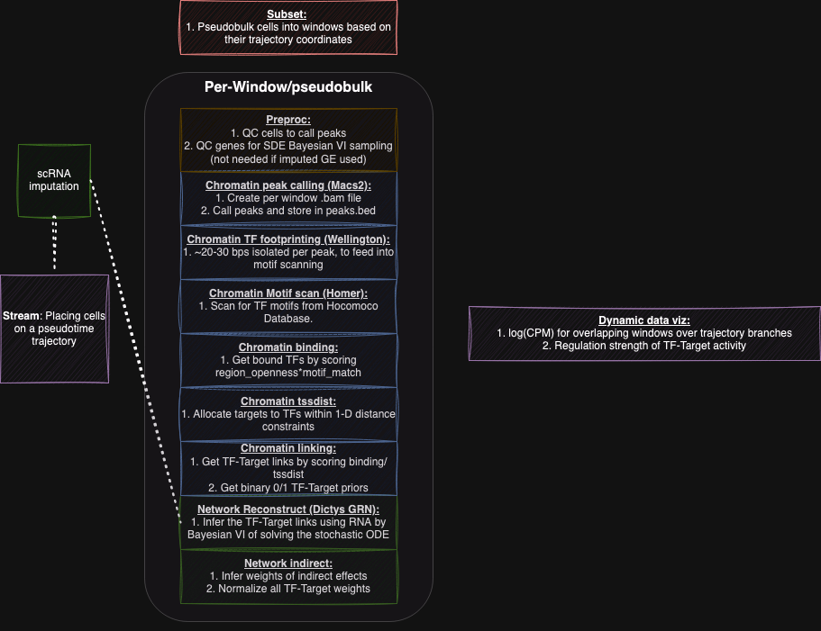

# Dictys_B_Cells
Gene regulatory control of B cells bifurcating into GC and PB states. Multiome molecular profiling (transcriptomics + chromatin accessibility) to characterize these cellular states and their dynamic gene interactions.

## Dictys Workflow

